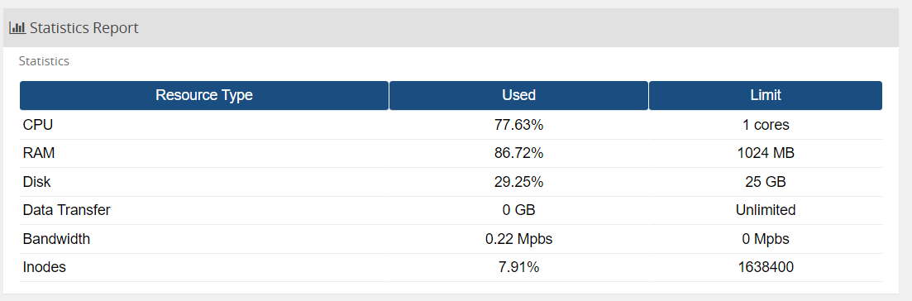
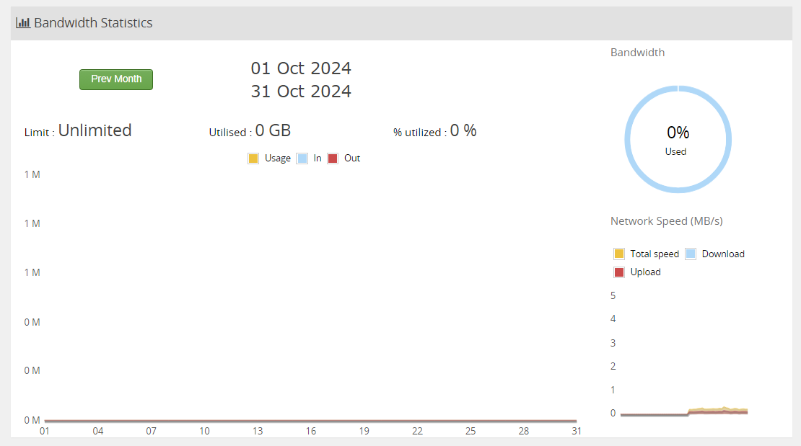
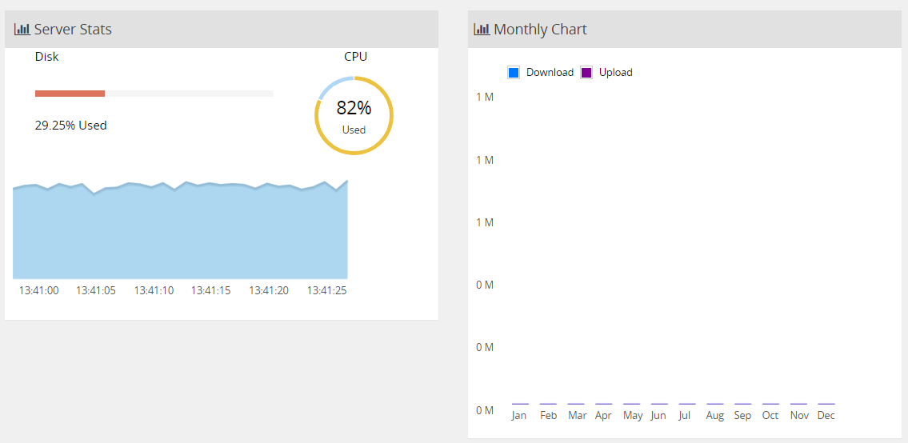
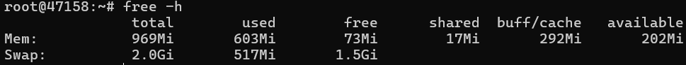
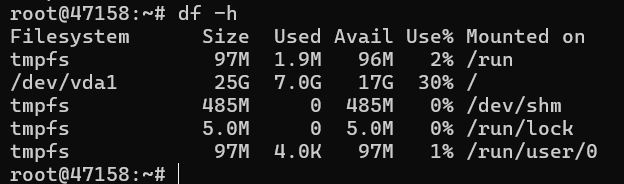
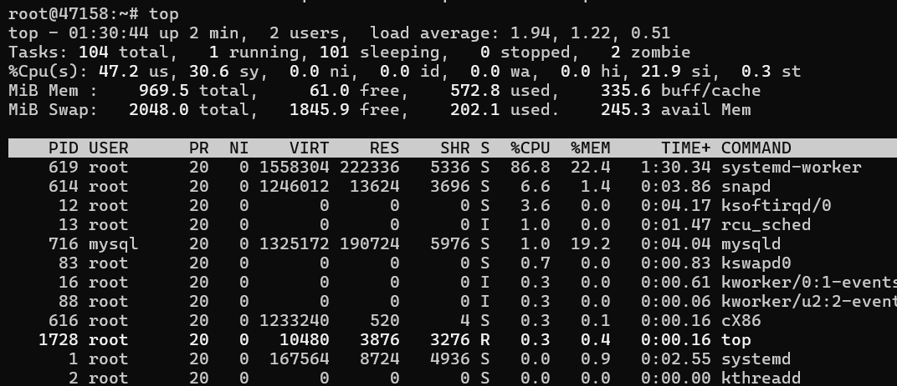
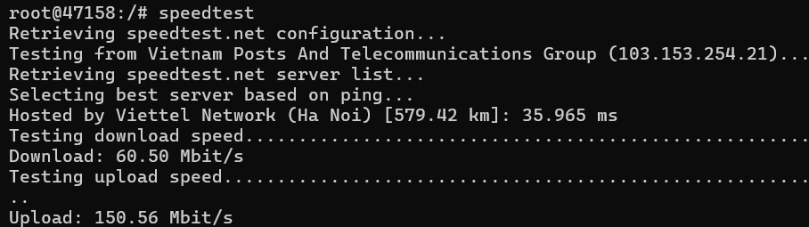
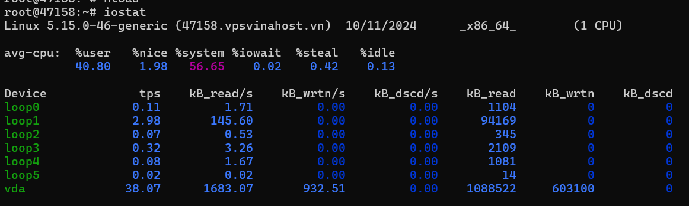
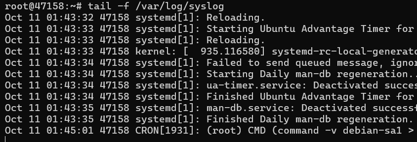
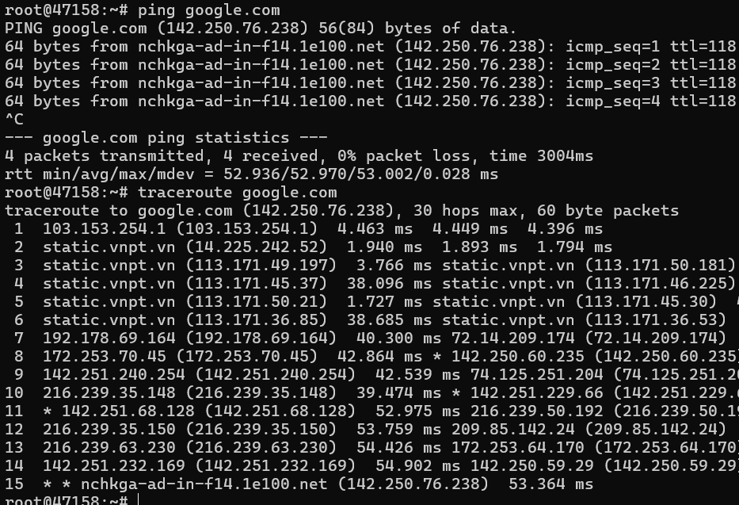

# <p align="center" style="font-size:25px;">Hướng dẫn kiểm tra cấu hình VPS</p>

VPS (Virtual Private Server) là một dạng máy chủ ảo được phân chia từ một máy chủ vật lý. Mỗi VPS hoạt động như một máy chủ độc lập, có hệ điều hành riêng, tài nguyên CPU, RAM, dung lượng lưu trữ và băng thông riêng. Khách hàng có toàn quyền quản lý và cấu hình VPS giống như đang sử dụng một máy chủ vật lý riêng biệt.

Sau khi kích hoạt gói dịch vụ, bạn sẽ được cung cấp tài khoản đăng nhập theo các phương thức như: sử dụng giao diện Remote Console, ssh cho hệ điều hành Linux, remote desktop cho hệ điều hành Windows. Bạn đăng nhập vào VPS theo các phương pháp này để tiến hành sử dụng.

### 1. Kiểm tra thông số trên Panel

Bạn có thể kiểm tra một vài thông số trực tiếp trên giao diện Panel.

Các thông số về CPU, RAM, Disk, BandWidth... đã sử dụng và giới hạn đăng ký.


Phân tích về Bandwidth đã sử dụng


Trực quan hóa dung lượng Disk, CPU


### 2. Kiểm tra thông số trên các dịch vụ quản trị từ xa 

- Sau khi ssh thành công vào VPS, chúng ta sẽ tiến hành kiểm tra các thông số được cấp phát.
<div style="text-align:center"></div>


- Kiểm tra RAM: sử dụng lệnh `free -h`
<div style="text-align:center"></div>
<p align="center">Hiển thị thông tin bộ nhớ RAM và swap ở định dạng dễ đọc</p>

- Kiểm tra Disk: sử dụng lệnh `df -h`
<div style="text-align:center"></div>
<p align="center">Hiển thị dung lượng sử dụng của các phân vùng đĩa.</p>

- Kiểm tra CPU: sử dụng lệnh `top`
<div style="text-align:center"></div>
<p align="center">Kiểm tra trạng thái CPU để đánh giá việc sử dụng tài nguyên CPU, phát hiện tình trạng quá tải hoặc hiệu suất không mong muốn.</p>

- Kiểm tra Download và Upload speed. Cài đặt speedtest-cli để tiến hành đo đạc
```
sudo apt install speedtest-cli
```

Sử dụng câu lệnh `speedtest` cho ra kết quả sau: Download 60.6 Mbit/s và Upload 150.56 Mbit/s



- Kiểm tra hiệu suất I/O đĩa: Cài đặt sysstat để sử dụng
```
sudo apt install sysstat
iostat
```


<p align="center">Kết quả.</p>

Hiệu suất đọc/ghi: Thiết bị vda có tốc độ đọc trung bình 1683.07 kB/s và tốc độ ghi trung bình 932.51 kB/s. Đây là các giá trị tương đối tốt đối với một hệ thống VPS nếu xét trong ngữ cảnh sử dụng thông thường.

%iowait rất thấp (0.02%), cho thấy rằng hệ thống không bị nghẽn khi chờ đợi các hoạt động I/O.

CPU Usage: CPU hệ thống dành khá nhiều thời gian cho các tác vụ hệ thống (%system chiếm 56.65%), có thể là do các dịch vụ hoặc tiến trình đang tiêu tốn tài nguyên CPU.

- Kiểm tra nhật ký hệ thống: Sử dụng lệnh `tail -f /var/log/syslog` 

> Nhật ký hệ thống giúp bạn phát hiện các vấn đề, lỗi và cảnh báo.


<p align="center">Log được hiển thị theo thời gian thực.</p>

- Kiểm tra kết nối mạng: 

> `ping`: để kiếm tra khả năng kết nối tới một IP hoặc tên miền
> `traceroute`: theo dõi đường đi của gói tin đến đích để phát hiện sự cố mạng


<p align="center">Kiểm tra ping và traceroute tới google.com</p>
