# 
Hướng dẫn kiểm tra cấu hình Web Hosting

Web Hosting là một dịch vụ trực tuyến cho phép các cá nhân và doanh nghiệp lưu trữ trang web của mình trên Internet. Khi bạn tạo một trang web, tất cả các tệp (hình ảnh, văn bản, video, dữ liệu...) của trang web phải được lưu trữ trên một máy chủ để mọi người có thể truy cập được. Đó chính là vai trò của dịch vụ Web Hosting. Vinahost tự tin là một trong những nhà cung cấp Web Hosting hàng đầu Việt Nam và trên thế giới.

### 1. Kiểm tra CPU và RAM

Truy cập vào cPanel để tiến hành quản lý

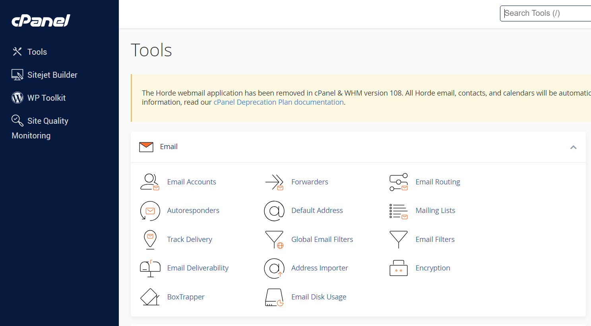

Giao diện của cPanel, có rất nhiều công cụ mà bạn có thể sử dụng ở đây

Ở thanh bên phải của giao diện có hiện thị các thông số của Web Hosting, sử dụng bao nhiêu và còn lại bao nhiêu, bạn có thể kiểm tra nhanh ở đây.

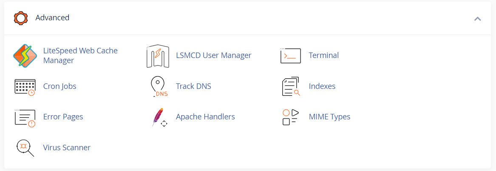

Kéo xuống dưới phần Advanced sẽ có mục Terminal, ta có thể sử dụng nó để truy cập vào máy ảo trực tiếp trên trình duyệt

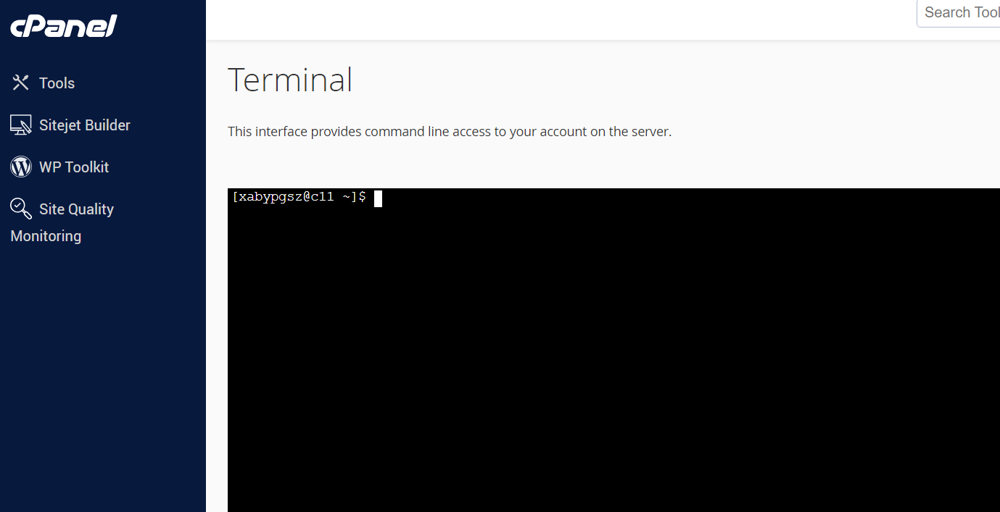

Giao diện Terminal trên trình duyệt

- Kiểm tra RAM: sử dụng lệnh `free -h`

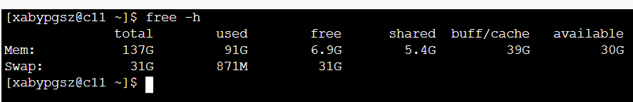

Hiển thị thông tin bộ nhớ RAM và swap ở định dạng dễ đọc

- Kiểm tra CPU: sử dụng lệnh `top`

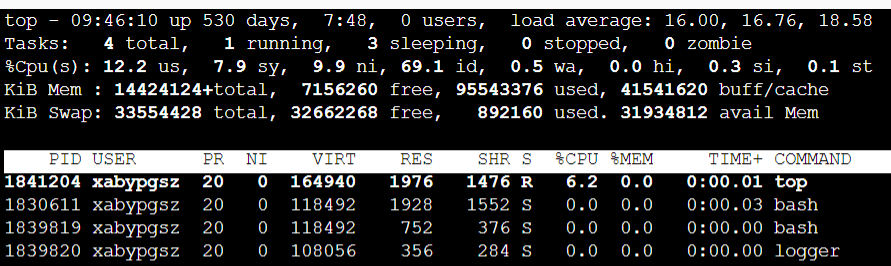

Kiểm tra trạng thái CPU để đánh giá việc sử dụng tài nguyên CPU, phát hiện tình trạng quá tải hoặc hiệu suất không mong muốn.

### 2. Dung lượng ổ cứng và I/O
- Kiểm tra Disk: sử dụng lệnh `df -h`

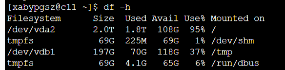

Hiển thị dung lượng sử dụng của các phân vùng đĩa.

### 3. Băng thông và Mạng

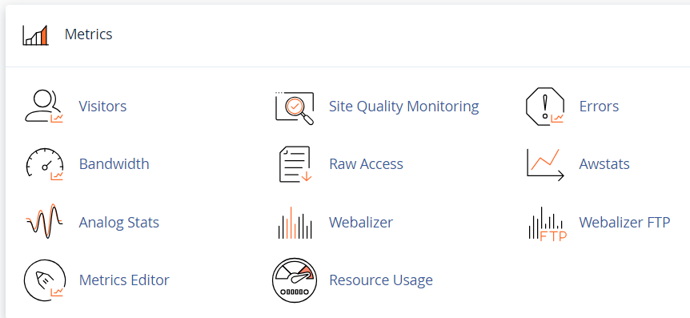

Tại phần Metrics trong trang quản lý cPanel, bạn có thể sử dụng các công cụ dưới để theo dõi server

- Sử dụng Bandwidth: theo dõi Bandwidth của trang web theo tháng, theo ngày, ước lượng Bandwidth sử dụng và đưa ra kế hoạch nâng cấp, thay đổi cho phù hợp...
- Sử dụng Webalizer: cung cấp các chart, graph phân tích ai đang truy cập vào website của bạn...

### 4. Chứng chỉ SSL

- Bạn có thể sử dụng chứng chỉ SSL miễn phí theo cách sau:

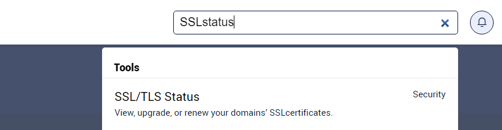

Truy cập vào Box Search tại cPanel và tìm kiếm SSL/TLS Status

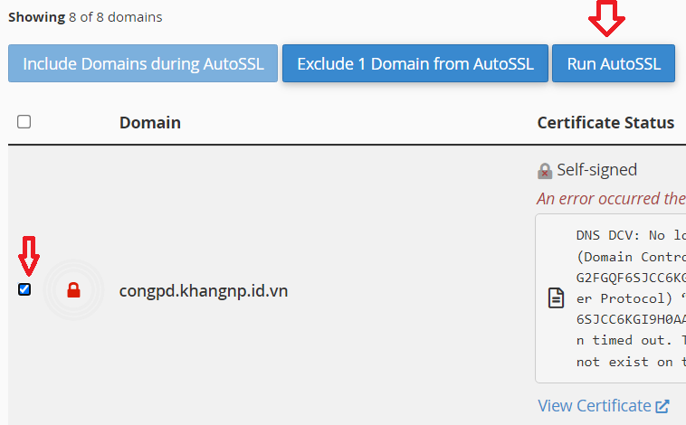

Lựa chọn Dmain và Click Run AutoSSL để nhận được SSL miễn phí

### 5. Email hosting

- Dịch vụ Web Hosting cũng bao gồm Email hosting, bạn có thể sử dụng nó.

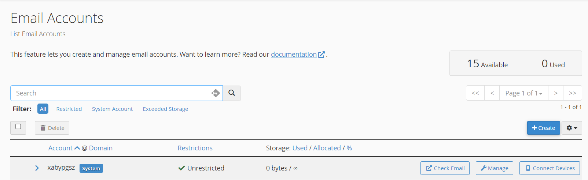

15 Email accounts có thể được khởi tạo

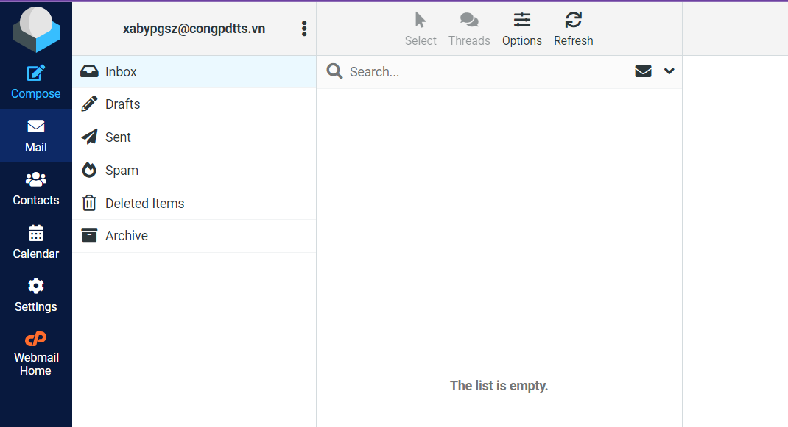

Có thể truy cập và gửi mail bình thường
