# 
Hướng dẫn kiểm tra tài nguyên Email Hosting

Email hosting là một giải pháp tuyệt vời cho cả cá nhân và doanh nghiệp, giúp cải thiện tính chuyên nghiệp và hiệu quả trong việc quản lý liên lạc qua email. Vinahost là nhà cung cấp dịch vụ này số 1 Việt Nam, đảm bảo hợp với nhu cầu của bạn và giúp bạn tối ưu hóa hiệu quả công việc, cũng như bảo mật thông tin an toàn tuyệt đối.

## 1. Kiểm tra các tài nguyên cơ bản

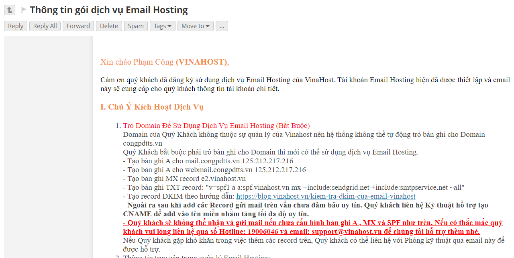

Thông tin về dịch vụ Email Hosting được gửi qua mail (kèm hướng dẫn cấu hình nếu không phải dns mà vinahost quản lý)

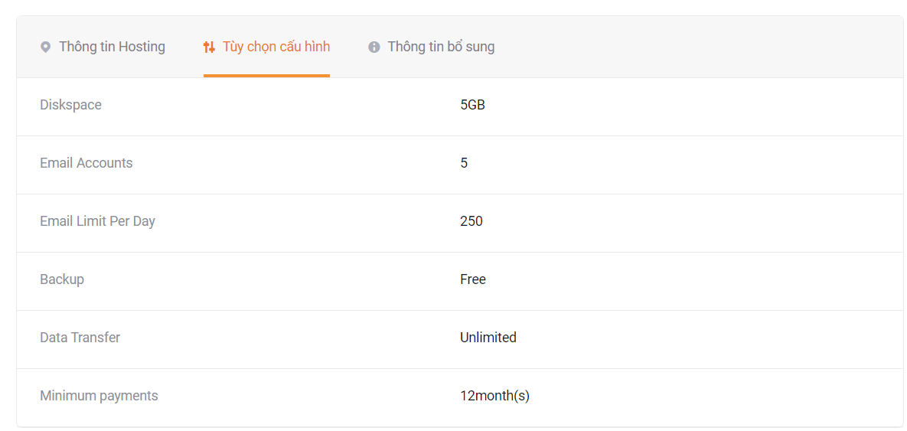

Cấu hình được cấp phát cho dịch vụ

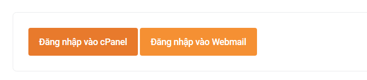

Cũng tại giao diện này, ta tiến hành truy cập vào cPanel để tiến hành các thao tác quản lý. Còn Webmail sẽ là giao diện thực hiện việc gửi và nhận mail.

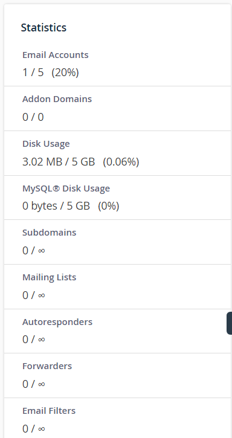

Tại phía bên phải của trang Web sẽ có một block hiển thị các thông tin cấu hình cơ bản của Email Hosting.

## 2. Kiểm tra khả năng gửi mail

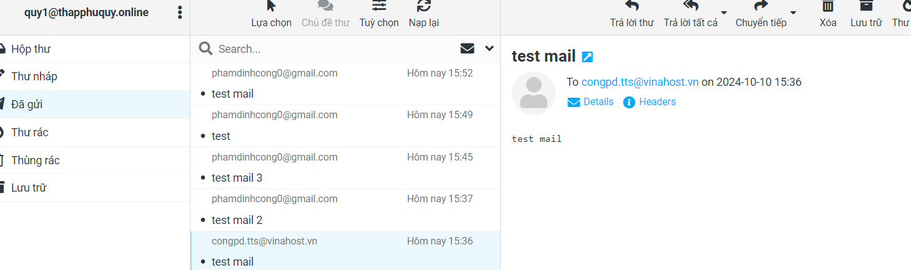

Gửi mail tới congpd.tts@vinahost.vn 

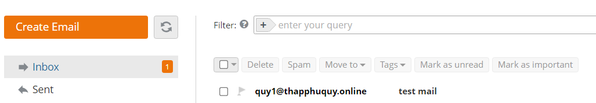

congpd.tts@vinahost.vn nhận được mail thành công

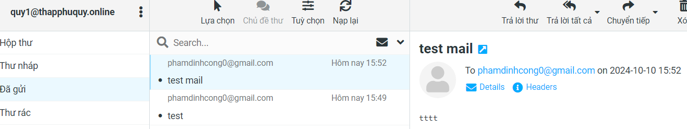

Gửi mail tới phamdinhcong0@gmail.com 

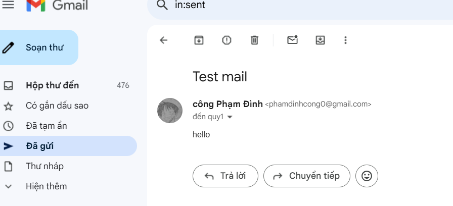

phamdinhcong0@gmail.com nhận mail thành công

## 3. Kiểm tra khả năng nhận mail

phamdinhcong0@gmail.com gửi mail tới

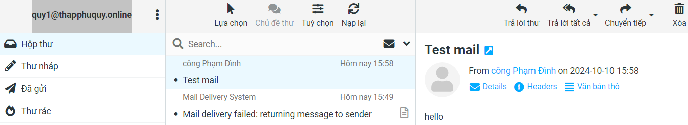

nhận được mail từ phamdinhcong0@gmail.com

## 4. Kiểm tra bảo mật

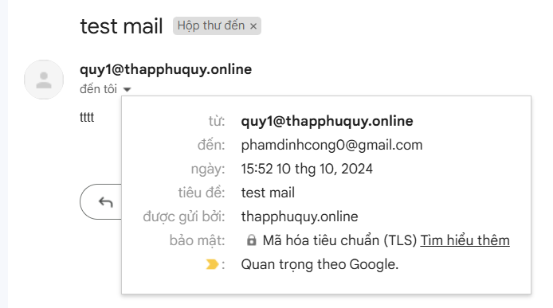

thư được gửi đi tới email khác được bảo mật TLS, giúp tăng uy tín và bảo mật cho thư

## 5. Kiểm tra khả năng spam của Email

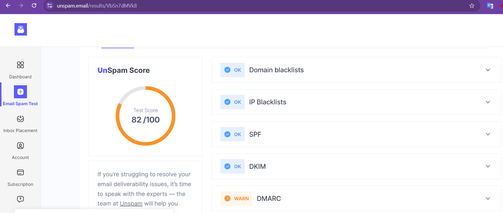

Test thử với một vài trang Web tính điểm tỉ lệ email bị đưa vào mục spam. Điểm số tương đối cao >80, nó còn phụ thuộc vào nội dung email của bạn, nếu đủ sạch thì tỉ lệ bị đưa vào mục spam là khá thấp.

## 6. Đăng nhập vào Outlook

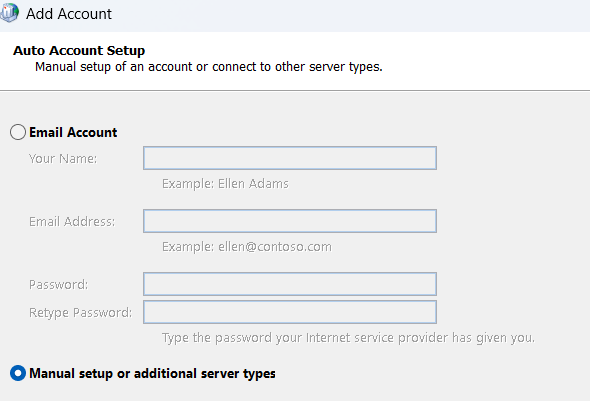

Truy cập control panel -> Mail (Microsoft Outlook) -> Manual setup

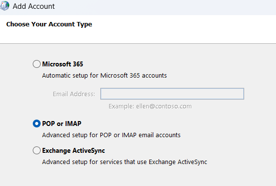

Lựa chọn POP or IMAP

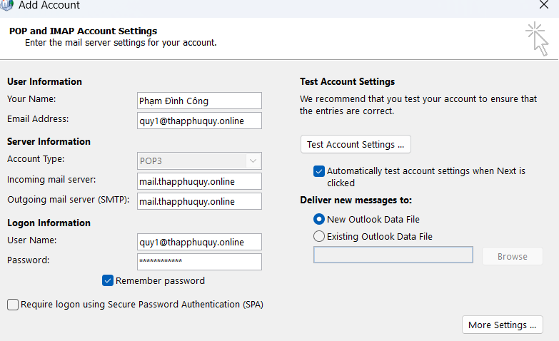

Điền thông tin đăng nhập (Thông tin Incoming và Outgoing mail server được gửi và lưu ý ở trong mail đăng ký dịch vụ)

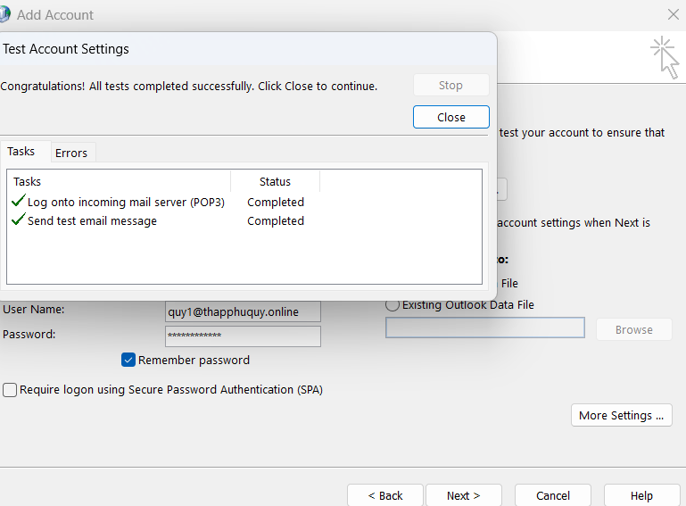

Thêm tài khoản mới thành công

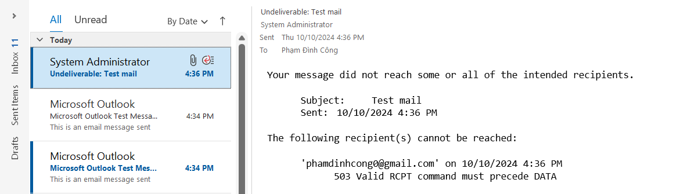

Gặp phải lỗi khi tiến hành gửi mail tới mail khác

> Lỗi này xảy rả khi bạn chưa cấu hình chính xác địa chỉ mail trên Outlook.

- Hướng dẫn sửa lỗi

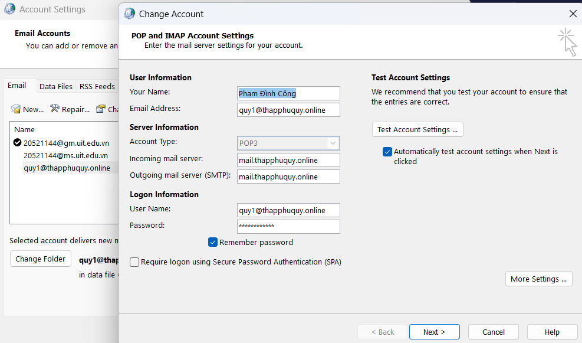

Truy cập control panel -> Mail -> account -> lựa chọn accout bị lỗi -> nhấn vào More Settings ở góc dưới bên phải

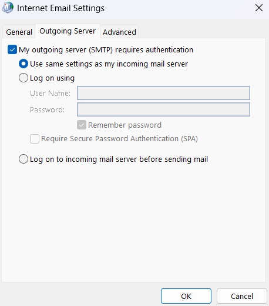

Click vào tùy chọn "My..."

> Như vậy là mail của bạn đã có thể gửi được mail thành công

## 7. Đăng nhập vào Thunder Bird

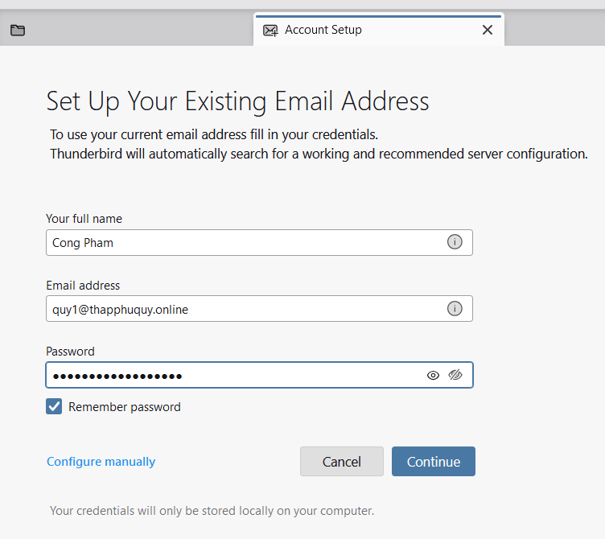

Nhập email, password đồng thời click vào "Configure manually" để thiết lập thêm thông tin.

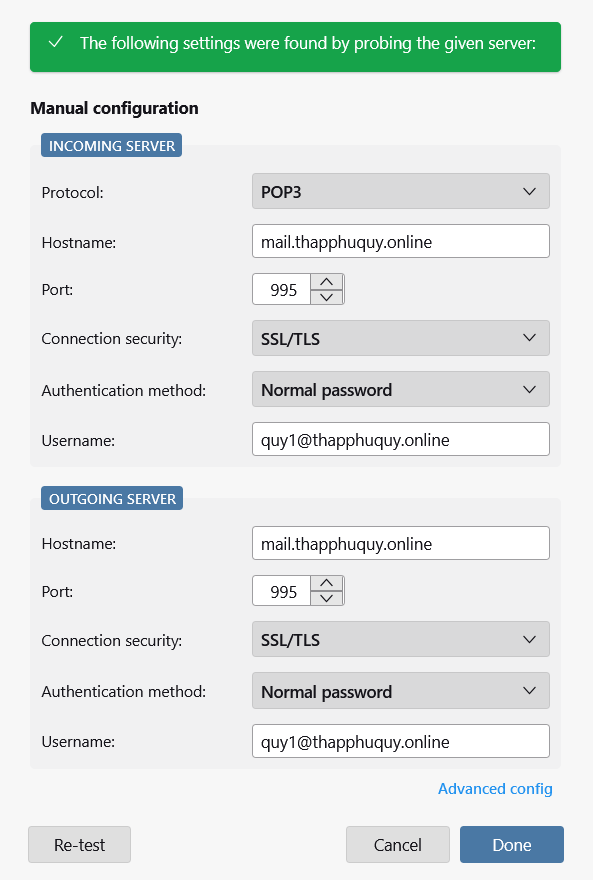

Thiết lập thông tin Incoming và Outcoming Server.

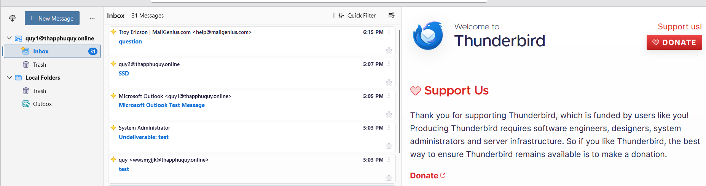

Đăng nhập thành công.

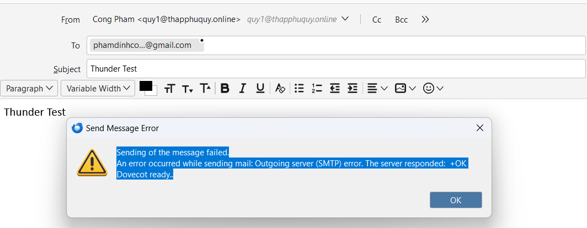

Lỗi sai cấu hình của Outgoing server SMTP.

> Sai cấu hình Port cho SMTP, phía trên cấu hình port 995 là sai, cần phải đổi lại thành 465, port mặc định của SMTP

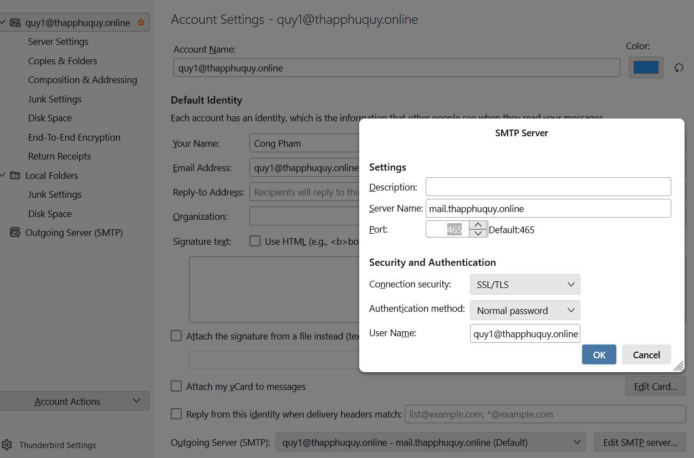

Vào Account Settings tiến hành chỉnh sửa

> Bây giờ Thunder Bird đã có thể gửi nhận mail bình thường