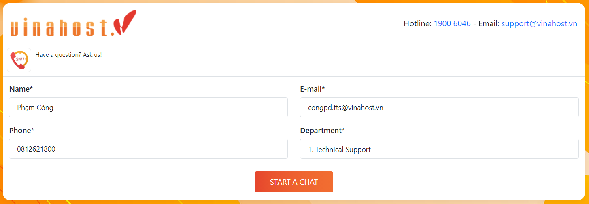
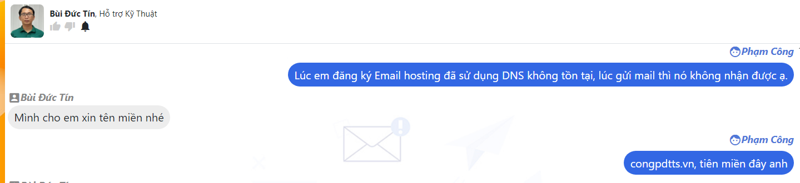
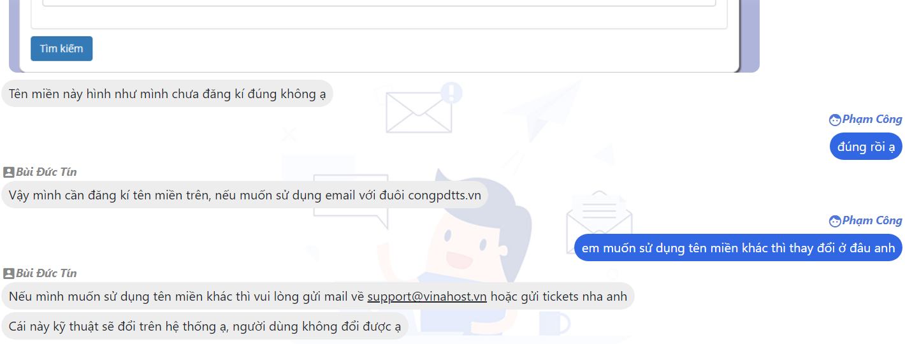
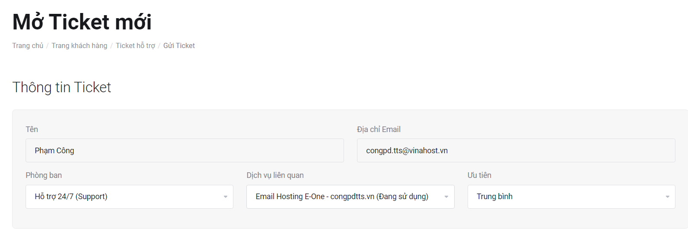
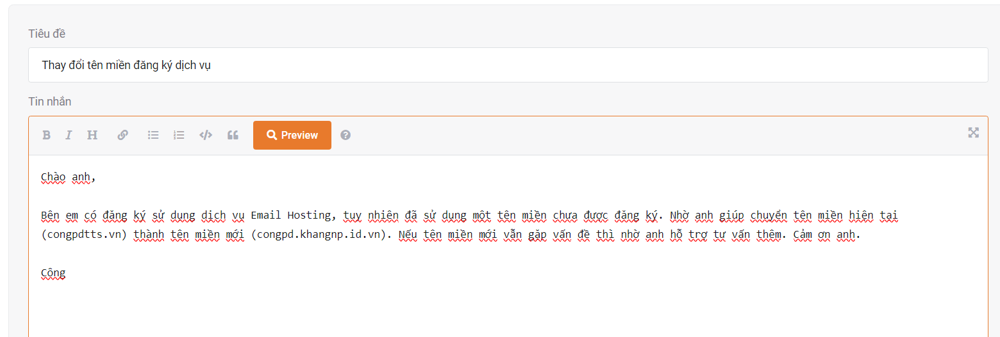
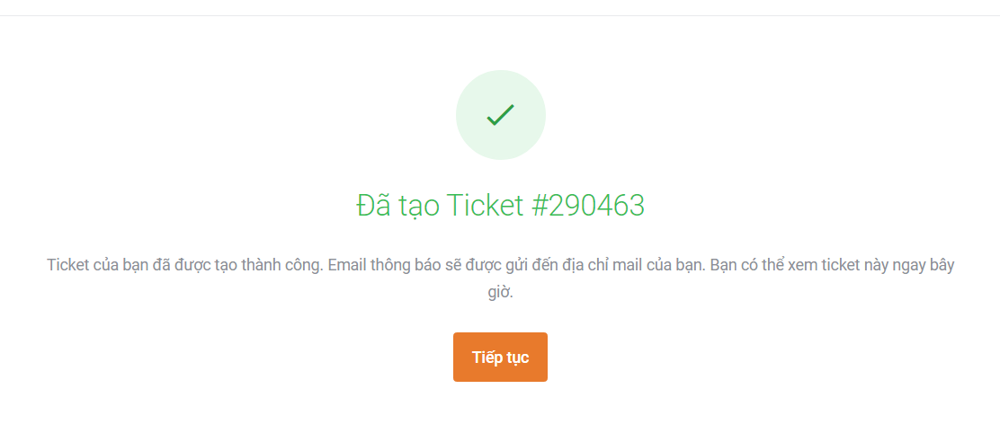
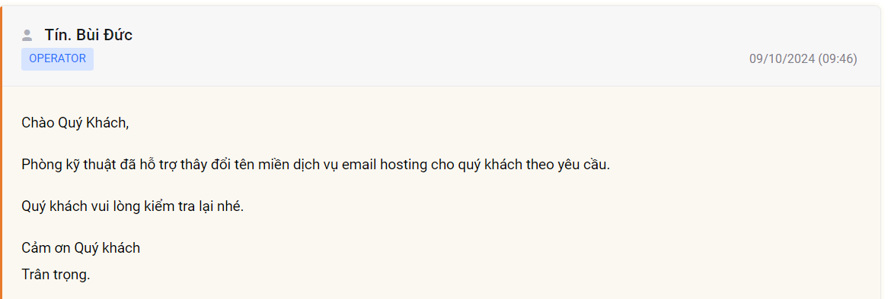
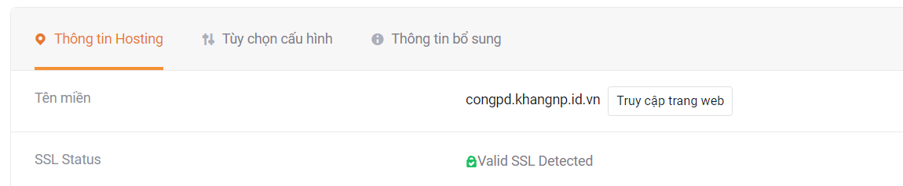

# 
Sử dụng Livechat - Ticket

- 
Vấn đề: khi đăng kí dịch vụ Email Hosting đã sử dụng DNS không tồn tại. Nên khi gửi mail đã không nhận được.

### 1. Sử dụng Livechat để liên hệ hỗ trợ

Tiến hành sử dụng livechat để nhờ sự giúp đỡ từ đội ngũ kĩ thuật

Tương tác với kĩ thuật viên

Với việc tên miền chưa đăng ký thì có 2 giải pháp là đăng ký tên miền đó, hoặc thay đổi một tên miền khác đã có. (Nếu lựa chọn phương án 2 thì sẽ liên hệ qua mail support hoặc gửi ticket)

### 2. Sử dụng Ticket để thay đổi tên miền

Tạo một Ticket mới nhờ hỗ trợ dịch vụ

Trình bày vấn đề và mong muốn

Tạo thành công Ticket mới và chờ phản hồi từ kỹ thuật viên

Kỹ thuật viên phản hồi Ticket

Tên miền đã được đổi thành công, đồng thời kích hoạt SSL

