# 
Thiết lập Password Manager

## 1. Quản trị hệ thống sẽ gửi mail Invite account đến mail _@vinahost.vn_ của nhân viên với tiêu đề  _**Welcome to passbolt**_ 

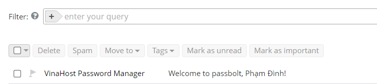

Mail Invite

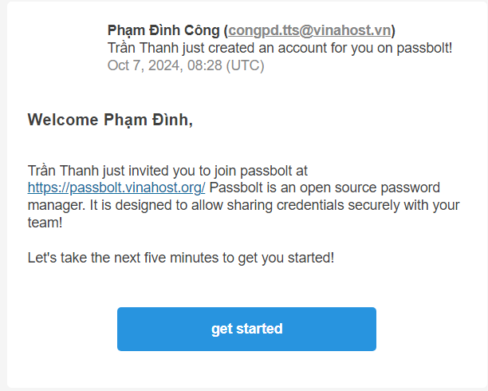

Nhấn vào nút "get started" để truy cập vào trang đăng ký 

## 2. Tiến hành làm theo các bước sau để cấu hình 

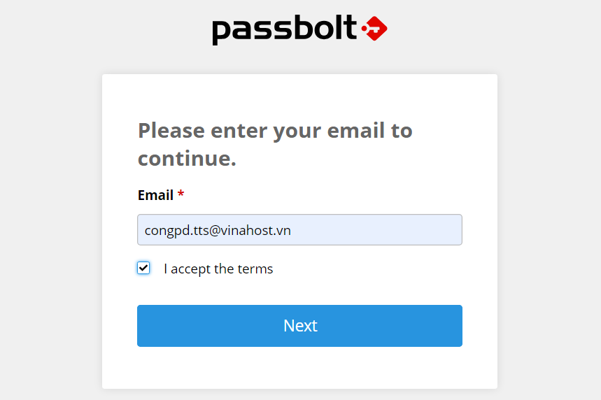

Nhập thông tin email @vinahost.vn 

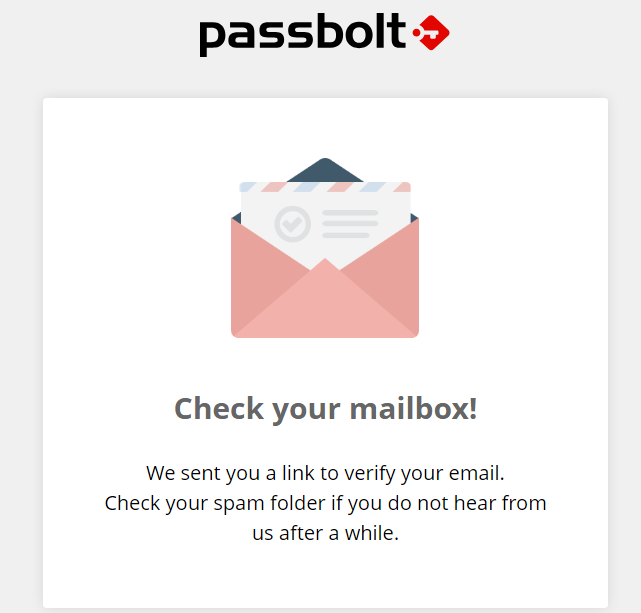

Hệ thống sẽ gửi một mail xác nhận vào email đăng ký (Có thể sẽ mất 30s-1p để nhận được mail) 

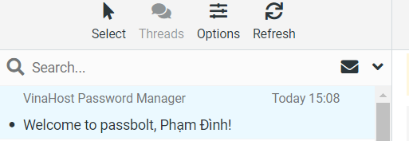

Một email với tiêu đề tương tự như email invite được gửi đến 

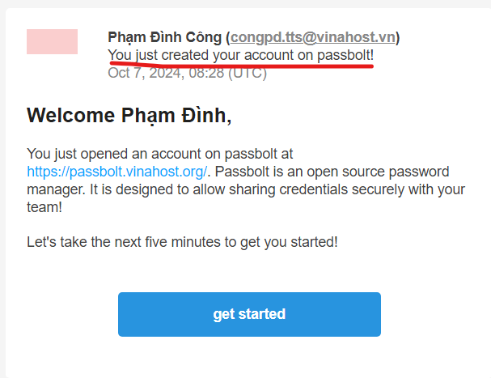

Điểm khác biệt là có thêm thông tin tạo tài khoản thành công, tiếp tục click vào "get started" 

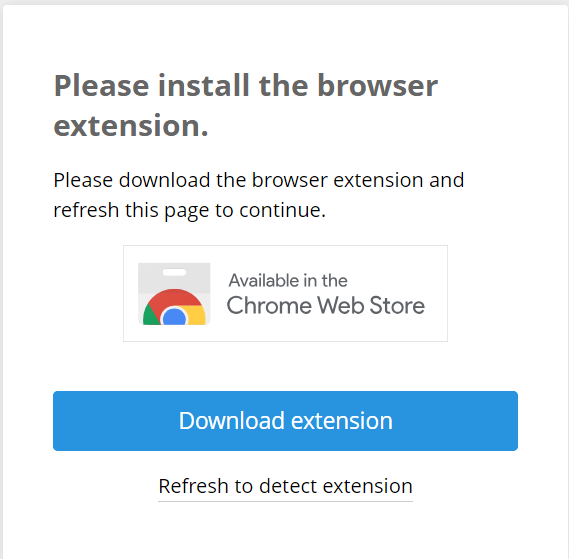

Cài đặt browser extension

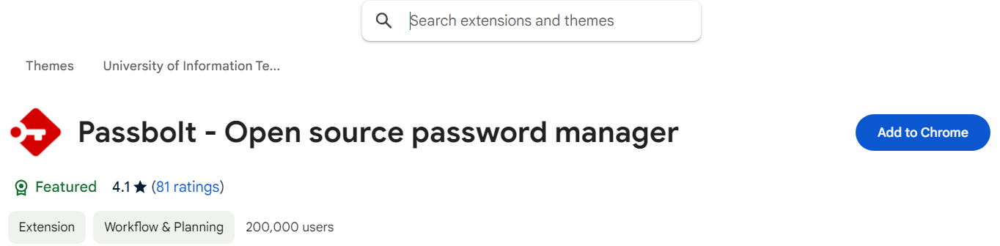

Click "Add to Chrome"

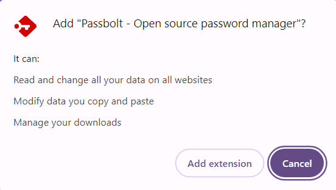

Một thông báo hiện ra và tiếp tục click "Add extension"

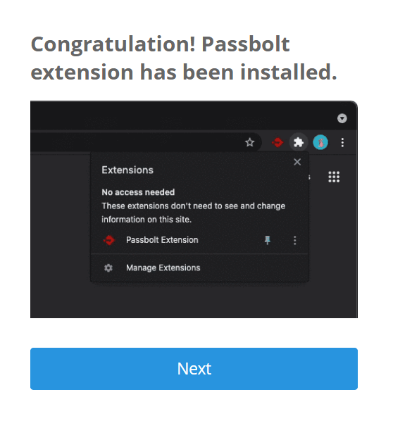

Sau khi cài đặt xong bạn sẽ được tự động đưa trở lại trang đăng ký. Tại đây bạn sẽ được xem một video hướng dẫn cách ghim Extension "Passbolt" của trình duyệt vào thanh công cụ. Việc ghim sẽ giúp bạn có thể truy cập nhanh chóng công cụ hữu ích này. Tiếp tục nhấn Next.

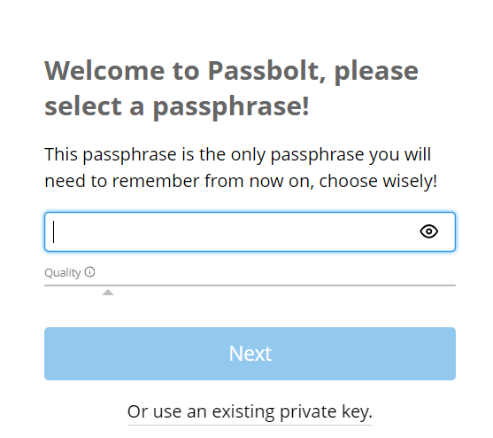

Tiến hành thiết lập passphrase, tương tự như password của các ứng dụng khác. Bạn sẽ chỉ cần nhớ mật khẩu này. (nên lựa chọn passphrase đủ dài và khó để tăng khả năng bảo mật)

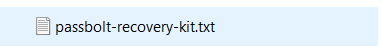

Trình duyệt sẽ tự động tải về một file "pasbolt-recovery-kit.txt", đây sẽ là file quan trọng mà bạn cần phải lưu trữ an toàn, phục vụ mục đích recovery.

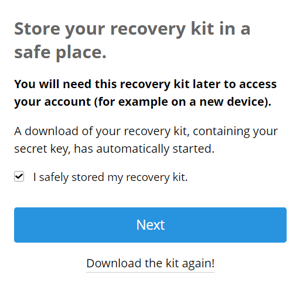

Sau khi đã lưu trữ file thì lựa chọn Next, hoặc tiến hành download lại file nếu lỡ làm mất.

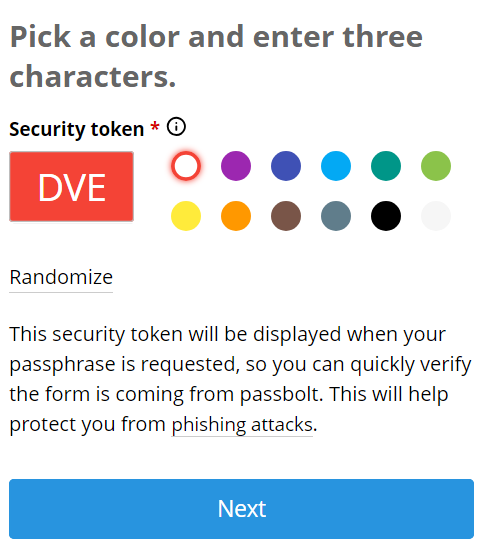

Lựa chọn 1 màu và 3 chữ cái (ở đây là màu đỏ và "DVE", có thể click vào để chỉnh sửa), đây là security token dùng để ngăn chặn phishing attack

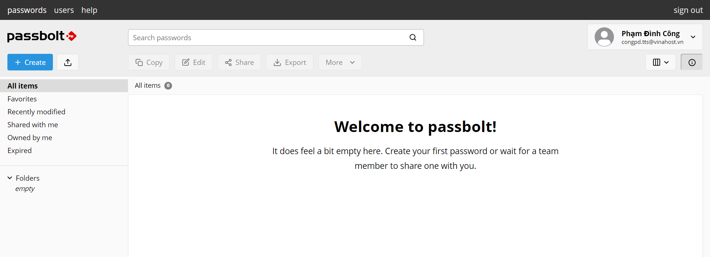

Sau khi nhấn next, bạn đã hoàn tất quá trình đăng ký và có thể thấy user workspace

