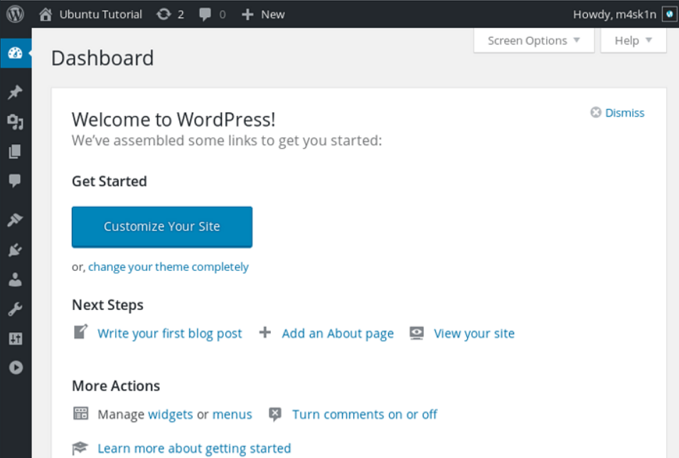

# <p align="center" style="font-size:17px;"> Triển khai Wordpress sử dụng LAMP stack </p>

### Wordpress là nền tảng mã nguồn mở phổ biến cho Bloging và CMS, dựa trên nền tảng MySQL và PHP. Các tính năng của wordpress có thể mở rộng dễ dàng dựa trên các plugins và themes miễn phí. Đồng thời có cộng đồng rộng lớn sẵn sàng hỗ trợ.

1. #### Yêu cầu 
 - Chuẩn bị một máy chủ VPS
 - Quyền đăng nhập root hoặc quyền truy cập sudo
2. #### Sửa lỗi _"Could not connect to de.archive.ubuntu.com:80"_
 - Truy cập vào file theo đường dẫn để sửa thông tin
 ```
 sudo nano /etc/apt/sources.list
 ```
 - Thay thế tất cả _"de.archive.ubuntu.com"_ thành _"archive.ubuntu.com"_
 ```
 deb http://archive.ubuntu.com/ubuntu/ focal main restricted universe multiverse
 ```
3. #### Cài đặt các dependences cần thiết
```
sudo apt update
sudo apt install apache2 \
                 ghostscript \
                 libapache2-mod-php \
                 mysql-server \
                 php \
                 php-bcmath \
                 php-curl \
                 php-imagick \
                 php-intl \
                 php-json \
                 php-mbstring \
                 php-mysql \
                 php-xml \
                 php-zip
```   
<br></br>

4. #### Cài đặt Wordpress
```
sudo mkdir -p /srv/www
sudo chown www-data: /srv/www
curl https://wordpress.org/latest.tar.gz | sudo -u www-data tar zx -C /srv/www
```
5. #### Cấu hình Apache cho Wordpress
- Tạo tệp tin và truy cập vào để điền thông tin cấu hình cho Apache
```
sudo nano /etc/apache2/sites-available/wordpress.conf
```
- Thêm nội dung vào file
```
<VirtualHost *:80>
    DocumentRoot /srv/www/wordpress
    <Directory /srv/www/wordpress>
        Options FollowSymLinks
        AllowOverride Limit Options FileInfo
        DirectoryIndex index.php
        Require all granted
    </Directory>
    <Directory /srv/www/wordpress/wp-content>
        Options FollowSymLinks
        Require all granted
    </Directory>
</VirtualHost>
```
- Enable site
```
sudo a2ensite wordpress
sudo a2enmod rewrite
sudo a2dissite 000-default
```
- Reload service apache để áp dụng các cấu hình
```
sudo service apache2 reload
```
6. #### Cấu hình cơ sở dữ liệu
- Khởi tạo MySQL Database
```
$ sudo mysql -u root
Welcome to the MySQL monitor.  Commands end with ; or \g.
Your MySQL connection id is 7
Server version: 5.7.20-0ubuntu0.16.04.1 (Ubuntu)

Copyright (c) 2000, 2017, Oracle and/or its affiliates. All rights reserved.

Oracle is a registered trademark of Oracle Corporation and/or its
affiliates. Other names may be trademarks of their respective
owners.

Type 'help;' or '\h' for help. Type '\c' to clear the current input statement.

mysql> CREATE DATABASE wordpress;
Query OK, 1 row affected (0,00 sec)

mysql> CREATE USER wordpress@localhost IDENTIFIED BY '<your-password>';
Query OK, 1 row affected (0,00 sec)

mysql> GRANT SELECT,INSERT,UPDATE,DELETE,CREATE,DROP,ALTER
    -> ON wordpress.*
    -> TO wordpress@localhost;
Query OK, 1 row affected (0,00 sec)

mysql> FLUSH PRIVILEGES;
Query OK, 1 row affected (0,00 sec)

mysql> quit
Bye
```
- Enable MySQL
```
sudo service mysql start
```
7. #### Cấu hình Wordpress kết nối tới Database
- Copy cấu hình mẫu vào file _wp-config.php_
```
sudo -u www-data cp /srv/www/wordpress/wp-config-sample.php /srv/www/wordpress/wp-config.php
```
<br></br>
<br></br>

- Thiết lập Database Credentials
```
sudo -u www-data sed -i 's/database_name_here/wordpress/' /srv/www/wordpress/wp-config.php
sudo -u www-data sed -i 's/username_here/wordpress/' /srv/www/wordpress/wp-config.php

```
- Thay thế _"your_password"_ thành mật khẩu mà bạn đã tạo cho MySql phía trên
```
sudo -u www-data sed -i 's/password_here/<your-password>/' /srv/www/wordpress/wp-config.php
```

- Mở file sau và tiến hành thay thế nội dung
```
sudo -u www-data nano /srv/www/wordpress/wp-config.php
```
- Thay thế đoạn mã sau
```
define( 'AUTH_KEY',         'put your unique phrase here' );
define( 'SECURE_AUTH_KEY',  'put your unique phrase here' );
define( 'LOGGED_IN_KEY',    'put your unique phrase here' );
define( 'NONCE_KEY',        'put your unique phrase here' );
define( 'AUTH_SALT',        'put your unique phrase here' );
define( 'SECURE_AUTH_SALT', 'put your unique phrase here' );
define( 'LOGGED_IN_SALT',   'put your unique phrase here' );
define( 'NONCE_SALT',       'put your unique phrase here' );
```
- Thành: Nội dung trong website sau (Thông tin khóa ngẫu nhiên để tiến hành mã hóa giúp tăng bảo mật cho Wordpress)
```
https://api.wordpress.org/secret-key/1.1/salt/.
```
8. #### Cấu hình Wordpress trên Website
- Truy cập vào đường dẫn sau trên trình duyệt
```
  http://your_ip_of_vps
```
- Khởi tạo một số thông tin cho user root: username, password, email...


- Giờ đây bạn có thể truy cập vào trang Web quản lý chính của Wordpress thông qua đường dẫn
 ```
  http://your_ip_of_vps/wp-login.php
 ```

 - Kết quả hiện thị như sau
 
 

 9. ### Thiết lập SSL cho Wordpress khi đã có domain _(nếu chưa có domain, liên hệ ngay vinahost.vn để tiến hành mua bán)_

 - Sử dụng Certbot để nhận được chứng chỉ ssl miễn phí giúp bảo mật và cho phép https trên domain. (Cài đặt dưới áp dụng cho Wordpress triển khai Apache)

 ```
sudo apt update
sudo apt install certbot python3-certbot-nginx
 ```

 - Cài đặt chứng chỉ ssl
 ```
 sudo certbot --apache -d your_domain
 ```

 - Chuyển tiếp http sang https: mở file cấu hình Apache
 ```
 sudo nano /etc/apache2/sites-available/congpd.khangnp.id.vn.conf
 ```
 - Thêm nội dung sau
 ```
<VirtualHost *:80>
    ServerName your_domain
    ServerAlias www.your_domain
    Redirect permanent / https://your_domain/
</VirtualHost>
 ```
 - Reload Apache
 ```
 sudo systemctl reload apache2
```

- Truy cập để kiểm tra kết nối https
```
https://your_domain/
```


- Tự động tạo mới ssl mỗi khi hết hạn

```
sudo certbot renew --dry-run
```
