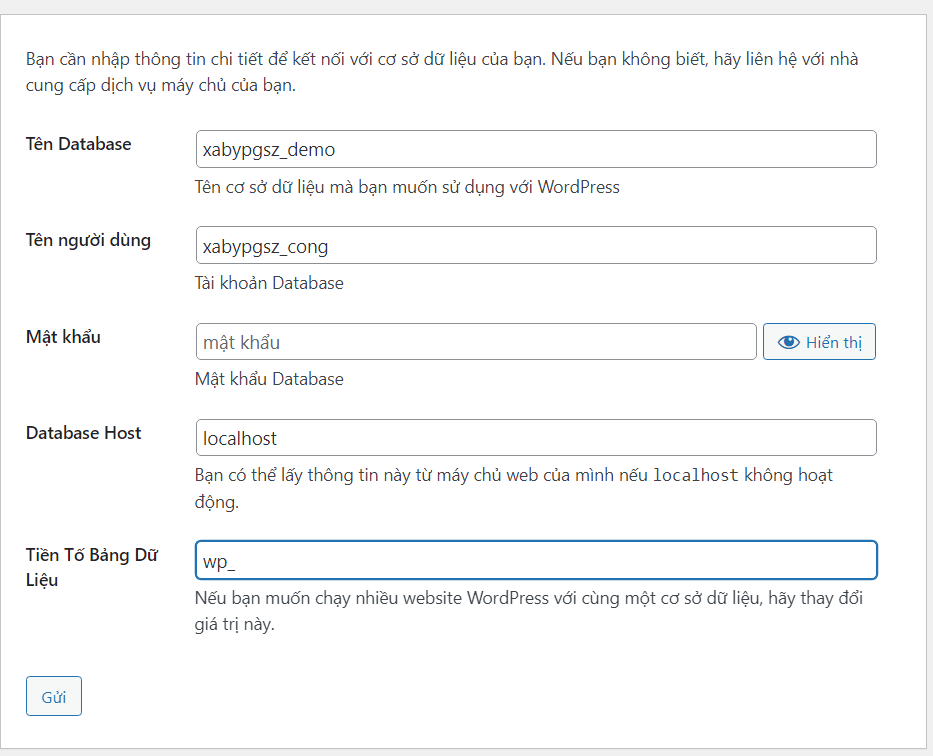

# 
 Triển khai Wordpress trên hosting cPanel 

## 1. Download mã nguồn Wordpress

- Truy cập vào đường dẫn [này](https://vi.wordpress.org/download/) để tiến hành tải mã nguồn Wordpress.

Tải xuống phiên bản mới nhất 6.6.2

<image src="image-112.png"/>

Bạn sẽ nhận được một file .zip

## 2. Truy cập vào trang quản trị cPanel

<image src="image-113.png"/>

Vào phần dịch vụ Web hosting và click vào "Đăng nhập vào cPanel"

## 3. Upload mã nguồn lên hosting

Kéo xuống và truy cập vào phần "File Manager"

Vào thư mục "public_html" và xóa hết file, thư mục hiện có

Chọn Upload để tiến hành upload mã nguồn wordpress lên

Chọn Upload và lựa chọn file .zip đã tải ở bước trên

Sau khi Upload và giải nén file .zip đó ta sẽ có một thư mục wordpress như trên

> Ta cần phải di chuyển tất cả nội dung trong folder wordpress ra ngoài, đồng thời xóa file .zip và folder wordpress

Như vầy là ta đã đưa mã nguồn lên thành công 

## 4. Tạo database trên cPanel

Quay trở lại cPanel và click vào  MySQL Databases

Nhập tên Database và tiến hành tạo

Tại phần user, khởi tạo một user với password đủ mạnh

Ta tiến hành thêm user đó vào trong database tạo ở phía trên

Khởi tạo quyền cho user này

## 5. Thiết lập Wordpress

> Truy cập vào tên miền đã đăng kí trước đó trên trình duyệt

Chúng ta sẽ thấy giao diện này, tiếp tục nhấn vào thực hiện ngay

Nhập tên database và user đã tạo trước đó

Xác thực database thành công

Khởi tạo user đăng nhập trang web

Tạo thành công

 
 
Đăng nhập với user vừa khởi tạo phía trên, ta sẽ vào được giao diện của Wordpress
